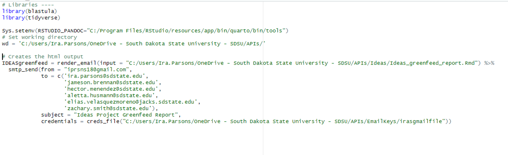
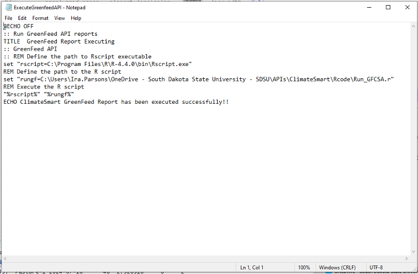
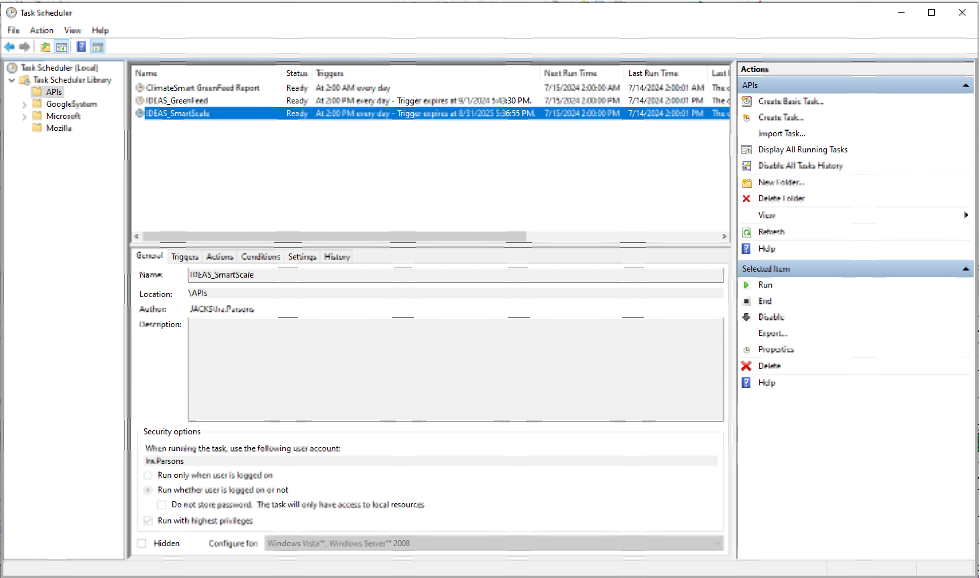
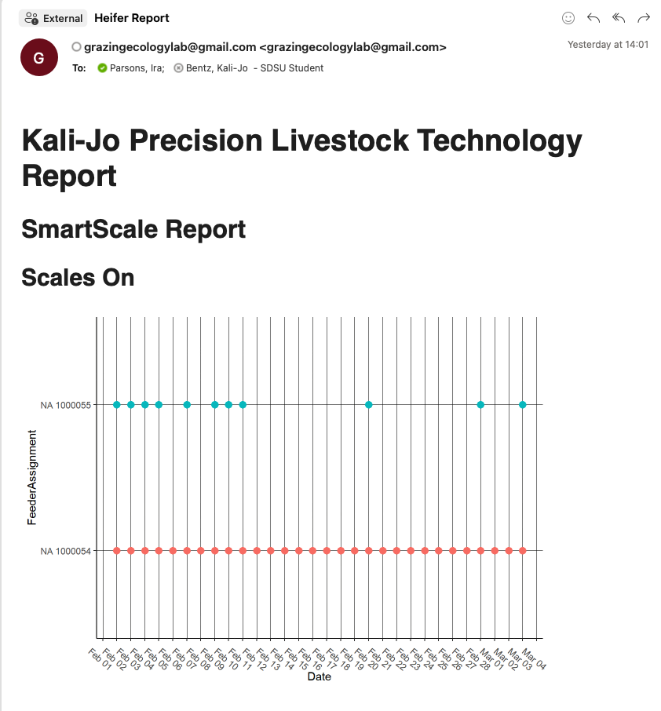

# Automating API Reports
As demonstrated above, API's allow routine and replicate access to online databases, making them extremely useful for integrating sensor systems via the internet of things infrastructure. Automated reports are a means of realizing and testing the true value of real-time data. Creating automated reports that land in your inbox serve as a way for scientists to realize the value of real-time data, and spark the creative juices to begin data analysis as the data comes in. And, on a more mundane but perhaps more importantly, it serves to improve project and equipment management by providing detailed reports for graduate students, advisors, and research managers to use to monitor precision livestock equipment, and fix issues in real-time as they arise. 

Creating the report

Create the report by following many of the same steps you would normally use to learn about your data at the beginning of any data analysis project. These steps are already given in the previous examples. After cleaning your data, organize the plots and information into a coherent report using Rmarkdown. This document allows combining data and writing, making it a simple solution to automate various data wrangling, processing, and reporting tasks. 

Sending the report to yourself

Now that you have the report created, wouldn't it be great to get it in your inbox, on your phone, or wherever was most convenient, daily? This would save you the time to start up your computer program and rerun daily reports. I automated my reports utilizing the Blastula package and a dumby gmail account.
1) First, create an r script to knit the markdown document. 
  + I included a couple of libraries statements,
  + Set up the system environment pointing to where my pandoc tools are installed (google this)
  + Specify the working directory where my code, files storing the data, and markdown files live
  + Finally, include the blastula code that renders an email from the rmarkdown document, and sends it using my gmail credentials. These email keys are protected text files downloaded from your dumby gmail account, and basically are what blastula uses to login and send your email message automatically
  
 

2) Next, we need to program the computer to tell it to automatically push "RUN" on your R script. To do this we will use a .bat (microsofts term for a batch) file. For those computer nerds among us, this is quite simple. Those who are just into R programing, this is a bit intimidating. But never fear, it is acually quite simple.
  + Create a simple text file using notepad on any windows computer
  + TITLE names the code, but this isn't important
  + :: comments out sections, similar to the # in R programing languange
  + define the path to your R program using the "set" command. Typically R will live in your computers program files on the C drive. This creates a command, named *rscript* that tells the computer to open R.
  + Next, define the path to the .R code we created in step 1, again using the "set" command. This creates a second command to open the r code, named *rungf* to run the gf feed code in the R environment created in the *rscript* command.
  + Execute the R script. This is done using the %rscript% "rungf% commands, run in tandem on the same line.
  + Finally, we can create a message that is printed if the script completes execution. We can also and a PAUSE command to the end of the script to keep the command line open after executing. This saves any errors that might have occured, and aids in problem solving.
  
 

3) Next, use microsoft scheduler to schedule the running of your .bat file that you just created. 
 
And now, Voila!! Providing you don't hit any errors, you should have an emailed report landing in your email inbox with important datails you decided were important for monitoring your equipment, and the ongoing state of the animals and research project in your care. 

