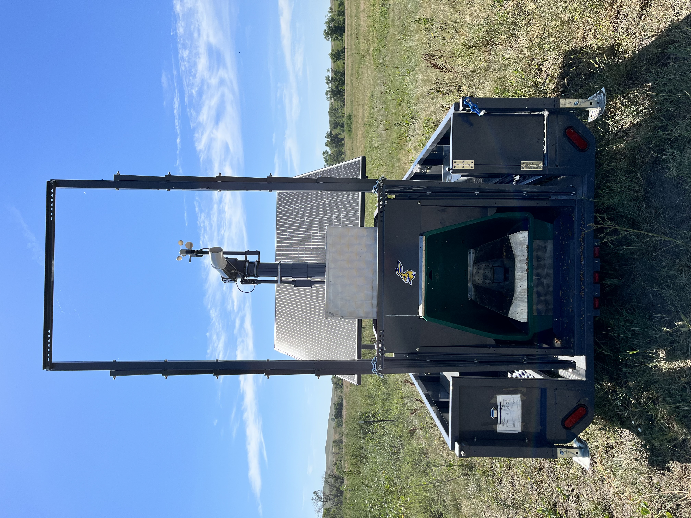

---
bibliography: references.bib
nocite: '@*'
---

# C-Lock Application Program Interfaces {-}

Authored by Drs. *Jameson Brennan^1^, Ira Parsons^1^, Hector Menendez^1^, Meredith Harrison^2^*   
*^1^South Dakota State University, Dept. of Animal Science, Rapid City SD*  
*^2^C-Lock Inc. Rapid City SD*

## Abstract
Advances in sensor technology have ushered in the ability to collect vast amounts of data in real-time for animal production systems. Though
there is much promise in improving animal production and research utilizing precision systems, for this technology to be truly impactful, data
generated needs to be accessed and processed in near real time for relevant decision-making. In this paper, three application programming
interfaces were developed to facilitate near real-time data access. In addition, open-source tutorials were developed to generate summary
statistics of three precision livestock technologies and systems checks to ensure equipment is working properly and animal adoption rates of
technology are adequate for data collection. The development of data processing outlined in this paper will be essential for the successful implementation of precision technology and integration of data in real time with animal nutrition or decision-making algorithms [@brennan].

<!--chapter:end:index.Rmd-->

# GreenFeed API
*Developed by Jameson Brennan, Ira Parsons, and Hector Menendez*
*Department of Animal Science, South Dakota State University*

The objectives of this markdown document is to automate the download and visualization of Greenfeed data provided by C-Lock. Users will need to provide their own login credentials to run the code. This markdown can be used to quickly visualize usage of Greenfeed machines and preliminary data.  

This is an R Markdown document. Markdown is a simple formatting syntax for authoring HTML, PDF, and MS Word documents. For more details on using R Markdown see <http://rmarkdown.rstudio.com>. When you click the **Knit** button a document will be generated that includes both content as well as the output of any embedded R code chunks within the document. The example below will print a statement and run a quick computation. 


```{r setup, warning=FALSE ,message=FALSE}
knitr::opts_chunk$set(echo = TRUE)
library(ggplot2)
```

## API

The first thing you need to do is to enter your variables for the code to run. In the quotations below you will need to change the username, password, FID (or greenfeed ID), and the start and end times for the data you want to download.

Two things to note are 1) you can enter multiple greenfeeds assocated with an account and 2) the start time and end time must be in the same format. The chunk below sets the end time to the computer time for the most recent downloads.

```{r}
#change to login user name 
USER <- "username"

#Change to login password
PASS <- 'Password'

#Change to greenfeed id or id's. The second line can be uncommented out for multiple greenfeeds
FID  <- "541"
#FID  <- "541,539,535,534"

#enter the start date (ST) and end date (ET) for the data you want to download
ST   <- "yyyy-mm-dd"
ET   <-  "yyyy-mm-dd"
```

```{r echo=FALSE}
source(file = '../Documents/Projects/2023_API-Paper/Rcode/GreenfeedAuth.R')
```

### Data Download

This code chunk will pull the data from the cloud based on the specifications of what was provided above.

```{r }
# Spaces must be replaced with %20


library(httr) # Must first install  httr with:   install.packages("httr")
library(stringr)
# First Authenticate to receive token:
req <- POST("https://portal.c-lockinc.com/api/login", body=list(user=USER, pass=PASS))
stop_for_status(req)
TOK <- trimws(content(req))


#URL="https://portal.c-lockinc.com/api/getemissions?d=visits&fids=297,298&st=2023-06-06%2000:00:00&et=2023-06-14%2012:00:00"


# Now get data using the login token
URL=paste0("https://portal.c-lockinc.com/api/getemissions?d=visits&fids=", FID, "&st=", ST, "&et=", ET, "%2012:00:00")
req <- POST(URL, body=list(token=TOK))
stop_for_status(req)

a <- content(req)

#Split the lines
perline <- str_split(a, "\\n")[[1]]

#Split the commas into a dataframe, while getting rid of the "Parameters" line and the headers line
df <- do.call("rbind", str_split(perline[3:length(perline)], ","))
df=as.data.frame(df)

colnames(df)=c('FeederID','AnimalName','RFID','StartTime','EndTime','GoodDataDuration',
                   'CO2GramsPerDay','CH4GramsPerDay','O2GramsPerDay','H2GramsPerDay','H2SGramsPerDay',
                   'AirflowLitersPerSec','AirflowCf','WindSpeedMetersPerSec','WindDirDeg','WindCf',
                   'WasInterrupted','InterruptingTags','TempPipeDegreesCelsius','IsPreliminary','RunTime')
```

## Data Visualization

This next section is used to generate a series of quick plots to summarize visits and data from the greenfeeds to check usage rates.

```{r  warning=FALSE ,message=FALSE}
#convert start time to date
df$Date=as.Date(df$StartTime)

df$RFID=stringr:: str_sub(df$RFID,-6,-1)

#get a count on the number of good observations by each greenfeed by day
library(dplyr)
daily_good_data=df %>% count(FeederID, Date, sort = TRUE)

daily_good_data=na.omit(daily_good_data)
ggplot(daily_good_data,aes(x=Date,y=n))+
  geom_bar(stat = 'identity')+
  scale_x_date(breaks = '2 day')+
  facet_wrap(~FeederID)+
  ggtitle('Number of good observations by GF by day')+
  ylab('Number of daily observations')+
  theme_light()+
  theme(axis.text.x = element_text(angle = -45))

```


```{r }
#get the number of unique animals visiting by day
rfid_day=df %>%                              # Applying group_by & summarise
  group_by(Date,FeederID) %>%
  summarise(count = n_distinct(RFID))


rfid_day=na.omit(rfid_day)

ggplot(rfid_day,aes(x=Date,y=count))+
  geom_bar(stat = 'identity')+
  facet_wrap(~FeederID)+
  scale_x_date(breaks = '2 day')+
  labs(title = 'Number of Unique animals per day')+
  theme_light()+
  theme(axis.text.x = element_text(angle = -45))

```


```{r }
df=na.omit(df)

df$CH4GramsPerDay=as.numeric(df$CH4GramsPerDay)

ggplot(df,aes(y=CH4GramsPerDay,x=Date))+
  geom_point(aes(color = RFID))+
  geom_smooth(method = 'lm', se = F)+
  ylim(0,300)+
  labs(title = 'Grams CH4 per day, colors individual animals ')+
  theme(legend.position = "none",
        axis.text.x = element_text(angle = -45))+
    theme_light()

```
```{r}
df %>% 
  filter(Date > (max(df$Date) - 7)) %>% 
  dplyr::group_by(Date, RFID) %>% 
  dplyr::summarise(CH4GramsPerDay = mean(as.numeric(CH4GramsPerDay), na.rm = T)) %>% 
  ggplot(aes(x=Date,y=CH4GramsPerDay, fill = RFID))+
  geom_boxplot()+
  # facet_wrap(~Assignment)+
  theme_classic()+
  theme(panel.grid.major = element_line(color = 'black', linewidth = 0.1),
        panel.grid.minor = element_line(color = 'grey', linewidth = 0.05),
        axis.text.x = element_text(angle = 45, hjust = 1),
        plot.caption = element_text(hjust = 0),
        legend.position = "right")
```


<!--chapter:end:01-GreenFeedTutorial.Rmd-->

# SmartScale API
*Developed by Jameson Brennan, Ira Parsons, and Hector Menendez*
*Department of Animal Science, South Dakota State University*

The objectives of this hands on tutorial are to introduce workshop participants to methods for streamlining SmartScale data processing tasks in R.
This is an R Markdown document. Markdown is a simple formatting syntax for authoring HTML, PDF, and MS Word documents. For more details on using R Markdown see <http://rmarkdown.rstudio.com>. When you click the **Knit** button a document will be generated that includes both content as well as the output of any embedded R code chunks within the document. The example below will print a statement and run a quick computation. 

## API
### Libraries

Our first step to processing the data is to import the libraries we will use to run our analysis. Each library contains a set of functions which can be used to process data. For example, the function mean() would sum the values in a column and divide by the number of observations in the column. This code will look to see if the necessary packages are installed on your computer and if not install and load them.

```{r, warning=F, message=F}
##if there is an error and a package or dependency needs to be updated un-comment the 
#code below and replace 'rvest' with package
#remove.packages('rvest')
#install.packages('rvest')

#Needed packages
  list.of.packages <- c("rvest",'tidyverse','data.table','lubridate',
                        'knitr','markdown','fasttime','MASS')
  new.packages <- list.of.packages[!(list.of.packages %in% 
                                       installed.packages()[,"Package"])]
  if(length(new.packages)) install.packages(new.packages)
library(rvest)
library(tidyverse)
library(data.table)
library(lubridate)
library(knitr)
library(rmarkdown)
library(fasttime)
library(MASS)
  
```

### Login Variables
The first thing you need to do is to enter your variables for the code to run. In the quotations below you will need to change the username, password, FID (or SmartScale ID), and the start and end times for the data you want to download.

Two things to note are 1) you can enter multiple greenfeeds assocated with an account and 2) the start time and end time must be in the same format. The chunk below sets the end time to the computer time for the most recent downloads.

```{r }
#change to login user name 
USERNAME <- 'demo_user'

#Change to login password
PASSWORD <- 'greenfeed'

#Change SmartScale id or id's. The second line can be uncommented out for multiple 
#SmartScales notice there is no space between commas for the multiple id's
SmartScale_ID  <- '1000119'
#SmartScale_ID   <- "1000119,1000121,1000132"

#enter the start date (ST) and end date (ET) for the data you want to download
date.start <- '2023-03-14'
date.end   <- '2023-06-01'

## Data parameters -----
FULL_WEIGHT <- 1 # 1 for full body weight calculated using C-Lock algorithm, 0 for raw 
#half-body weights, full weights calculated by taking the front end weight * 1.76
GET_VISITS <- 1 #Put 1 to get individual visits, Put 0 to get daily averages

```

### Data Download
This code chunk will pull the data from the cloud based on the specifications of what was provided above.

```{r  warning=FALSE}

# Local system setup ----
## Choose a temp folder to download the CSV to ----
if(Sys.info()["sysname"] == "Darwin"){
  TEMP_DIRECTORY <- "/tmp" #For Mac or Linux
}else{
  TEMP_DIRECTORY <- "."    #For Windows (Maybe put C:\Users\yourusername\Desktop)
}

## Load required libraries ----
suppressWarnings(suppressMessages(try(require(rvest), silent = TRUE)))
suppressWarnings(suppressMessages(try(require(httr), silent = TRUE)))
suppressWarnings(suppressMessages(try(require(RCurl), silent = TRUE)))

## Login URL -----
login_url <- "https://greenfeed.c-lockinc.com/GreenFeed/checklogon.php"

## API URL -----
if (GET_VISITS == GET_VISITS) {
  #Download URL - Individual Visits Weights
  download_url <- paste0("https://greenfeed.c-lockinc.com/GreenFeed/tabledata/sfanimals/getanimalweightdetails.php?dl=1",
                         "&fids=0,", SmartScale_ID,
                         "&st=", date.start,
                         "&et=", date.end,
                         "&full=", FULL_WEIGHT);
} else {
  #Download URL - Daily Average Weights
  download_url <- paste0("https://greenfeed.c-lockinc.com/GreenFeed/tabledata/sfanimals/animalweights.php?dl=1&summary=0",
                         "&fids=0,", SmartScale_ID,
                         "&from=", date.start0,
                         "&to=", date.end,
                         "&full=", FULL_WEIGHT);
}

# Download data ----
## Log into the website using URL requests -----
{
  #Create session then download form data
  session <- session("https://greenfeed.c-lockinc.com/GreenFeed")
  form <- html_form(read_html(login_url))[[1]]
  
  #Set login credentials
  form <- set_values(form, username = USERNAME)
  form <- set_values(form, password = PASSWORD)
  suppressWarnings(form <- set_values(form, redir = "home.php?logout")) #This will give you a warning - we can hide it with suppressWarnings
  
  #Save main page url
  suppressMessages(main_page <- submit_form(session, form))
  
  #Download the data
  download <- jump_to(main_page, download_url)
}

# Decode binary data ----
#Because the downloaded data is binary data, you must write it to a temporary file then read it back as a CSV.
## Write data to a file ----
FILENAME <- paste0(TEMP_DIRECTORY, "/C.txt")
writeBin(download$response$content, FILENAME)

#Read the CSV into a df dataframe
if (GET_VISITS == 1) {
  #SmartScale Headers are: "Link" "StartTime" "StopTime" "FeederID" "Duration" "AnimalName" "RFIDTag" "Weight" "Valid"
  colclasses=c("character", "POSIXct", "POSIXct", "integer", "integer", "character", "character", "integer", "character");
} else {
  #SmartScale Headers are: "Link" "StartTime" "StopTime" "FeederID" "Duration" "AnimalName" "RFIDTag" "Weight" "Valid"
  colclasses=c("character", "character");
}

d.smart = fread(file = FILENAME, header=TRUE, sep=",", quote="\"", colClasses = colclasses) # Read into data.table
d.smart[d.smart == 0] <- NA # Replace 0's with NA


```


## Data Processing 
 This is the raw dataset downloaded from the SmartScale API.The code chunk will print the first five rows of data in table format.

```{r}
knitr::kable( head(d.smart))
```

We can see that the 'view' column is likely not necessary and can be removed. In addition, we will create a new column called 'Date' that converts the start time to a Date only value. Lastly we will convert the 14 digit RFID number to only the last 6 digits to simplify identifying unique animals. 

```{r  }
#Remove unnecessary columns
d.smart$View=NULL


#convert date time to date value to look at daily visits
d.smart$Date=as.Date(d.smart$StartTime)
d.smart$RFIDTag= stringr:: str_sub(d.smart$RFIDTag,-6,-1) #get last 6 digits of RFID
```

One of the first steps to processing and cleaning data is to plot it. This code chunk will get the number of daily visits for each scale and plot it by day.

## Data Visualization

This next section is used to generate a series of quick plots to summarize visits and data from the SmartScales to check usage rates. This can be helpful to plot is animals are routinely using the equipment and to see if there are any sudden changes in usage rate that may indicate either a issue with the technology or access.


```{r,message=F}
#get the number of unique animals visiting by day
rfid_day=d.smart %>%                              # Applying group_by & summarise
  group_by(Date,FeederID) %>%
  summarise(count = n_distinct(RFIDTag))


rfid_day=na.omit(rfid_day)

ggplot(rfid_day,aes(x=Date,y=count))+
  geom_bar(stat = 'identity')+
  facet_wrap(~FeederID)+
  ggtitle('Number of Unique animals per day')


```

```{r  warning=FALSE ,message=FALSE}
#convert start time to date
d.smart$Date=as.Date(d.smart$StartTime)

d.smart$RFID=stringr:: str_sub(d.smart$RFID,-6,-1)

#get a count on the number of good observations by each greenfeed by day
library(dplyr)
daily_good_data=d.smart %>% count(FeederID, Date, sort = TRUE)

daily_good_data=na.omit(daily_good_data)
ggplot(daily_good_data,aes(x=Date,y=n))+
  geom_bar(stat = 'identity')+
  facet_wrap(~FeederID)+
  ggtitle('Number of observations by SmartScale by day')+
  ylab('Number of daily observations')

```


The smartscale data has a column named 'Valid' that flags potentially bad data in the system based on quantiles. The following plots show the bad data labeled as Valid = No for the entire dataset and for an individual animal. 

```{r  }

#plot animal weight by date
ggplot(d.smart,aes(x=Date,y=Weight,color=Valid))+
  geom_point()

ggplot(subset(d.smart,RFIDTag=='679563'),aes(x=Date,y=Weight,color=Valid))+
  geom_point()


```

This next chunk of code will remove the observations that are not valid and replot the data.  

```{r  }

#Remove not valid points
d.smart=subset(d.smart,Valid!='No')
#plot animal weight by date
ggplot(d.smart,aes(x=Date,y=Weight))+
  geom_point()


```

### Further Data Cleaning and Filtering

This next code chunk will add day of trial to the dataframe which will help for calculating average daily gain (ADG)

```{r}
# Add days to data
d.tdays = data.table(Date = seq.Date(from = as.Date(min(d.smart$Date)), 
                                     to = as.Date(max(d.smart$Date)), by = 1), 
                     tday = as.numeric(seq(from = 0, 
                                           to = difftime(max(d.smart$Date), min(d.smart$Date), units = "days"))))
d.smart = d.tdays[d.smart, on = 'Date'] 
d.smart[, Weight:= as.numeric(Weight)]
d.smart[, RFIDTag := as.character(RFIDTag)]

```

In addition to flagging the data as valid or not valid, Parsons et al., 2023 proposed an additional method using robust regression to remove potentially bad data from in pasture weighing systems. We will apply that method below [@parsons]. 

```{r}
# Filter Spurious weights using robust regression (Parsons et al., 2023)
m.rob = rlm(Weight ~ RFIDTag + tday, data = d.smart)
d.smrtrob = data.table(FeederID = d.smart$FeederID, 
                       RFIDTag = d.smart$RFIDTag,
                       Date = d.smart$Date,
                       tday = d.smart$tday,
                       StartTime = d.smart$StartTime,
                       Duration = d.smart$Duration,
                       Weight = d.smart$Weight,
                       resid = m.rob$residuals,
                       hwt = m.rob$w)

## Assign outliers
d.smrtrob[, Outlier := fifelse(hwt > 0.99, 'In Range','Outlier')]

ggplot(subset(d.smrtrob,RFIDTag=='679563'),aes(x=Date,y=Weight,color=Outlier))+
  geom_point()

d.smart = d.smrtrob[Outlier == 'In Range', ] # Filter to in range points
```

Using the table function we will get the number of daily weights for each individual animal. We can see that several tags only have a few observations while others have hundreds. These are could be test tags that were used to test the scales or had animals that infrequently used the equipement. The code below will delete individual tags with less than 6 observations. 

```{r  }

table(d.smart$RFIDTag)
d.smart=d.smart %>% group_by(RFIDTag) %>% filter(n()>= 6) %>% ungroup()
table(d.smart$RFIDTag)
```

## Animal Performance

Next we want to calculate the average daily gain. To do so we can fit a linear regression to get a model for to estimate weight by day of trial. If we wanted to fit a linear model to the entire herd we can do so using all available data with Weight as our y and trial day as our x. The code below fits this linear model.


```{r}
model_all_animals=lm(Weight~tday,data=d.smart)
summary(model_all_animals)
```


We can see that the intercept of the model is 536, which would equate to our average starting weight for the herd and the slope is 1.96 which would equate to our average daily gain (ADG). Plotting it we can see the relationship.

```{r, warning=F,message=F}
ggplot(d.smart,aes(y=Weight,x=tday))+
  geom_point()+
  geom_smooth(method=lm)
```

Though herd level ADG is important, using precision data we can also look at individual animal ADG. To do so we need to run a linear model for each individual animal. The code below will loop through each individual animal, subset the data based on RFID tag, create a linear model as above, extract the slope and intercept for the model, and save them in a new dataframe that contains the RFIDtag, slope, and intercept for each individual animal.

```{r}

ADG_individual=data.frame()   


for (i in 1:length(unique(d.smart$RFIDTag))){
    
    sublm=subset(d.smart,RFIDTag==unique(d.smart$RFIDTag)[i])
    mod=lm(sublm$Weight~sublm$tday)
    int= mod$coefficients[1]
    slope=mod$coefficients[2]

    
    sub_df=data.frame(unique(sublm$RFIDTag),int,slope)
    ADG_individual=rbind(ADG_individual,sub_df)
}

row.names(ADG_individual) <- NULL

```


Plotting the data we can see the slope and intercept for each animal with the RFID tag. 

```{r,warning=F}
colnames(ADG_individual)=c('RFIDTag','Intercept','Slope')


ggplot(ADG_individual,aes(x=Intercept,y=Slope,label=RFIDTag))+
  geom_point(size=2,color='Red')+
  geom_text(hjust=0, vjust=0)+
  ggtitle('ADG and Starting Weight for Individual Animals')+
  xlab("\nStarting Weight (Intercept) in Lbs")+
  ylab('ADG (Slope) in Lbs \n')
```


<!--chapter:end:02-SmartScale_Markdown.Rmd-->

# SmartFeeder API
*Developed by Jameson Brennan, Ira Parsons, and Hector Menendez*
*Department of Animal Science, South Dakota State University*

The objectives of this hands on tutorial are to introduce workshop participants to methods for streamlining SmartFeeder data processing tasks in R.  

This is an R Markdown document. Markdown is a simple formatting syntax for authoring HTML, PDF, and MS Word documents. For more details on using R Markdown see <http://rmarkdown.rstudio.com>. When you click the **Knit** button a document will be generated that includes both content as well as the output of any embedded R code chunks within the document. The example below will print a statement and run a quick computation.  

## API
### Libraries  
Our first step to processing the data is to import the libraries we will use to run our analysis. Each library contains a set of functions which can be used to process data. For example, the function mean() would sum the values in a column and divide by the number of observations in the column. This code will look to see if the necessary packages are installed on your computer and if not install and load them.

```{r, warning=F, message=F}
##if there is an error and a package or dependency needs to be updated un-comment the 
#code below and replace 'rvest' with package
#remove.packages('rvest')
#install.packages('rvest')

#Needed packages
  list.of.packages <- c("rvest",'httr','RCurl','tidyverse','data.table','lubridate',
                        'knitr','markdown','fasttime','MASS')
  new.packages <- list.of.packages[!(list.of.packages %in% 
                                       installed.packages()[,"Package"])]
  if(length(new.packages)) install.packages(new.packages)
library(rvest)
library(httr)
library(RCurl)
library(tidyverse)
library(data.table)
library(lubridate)
library(knitr)
library(rmarkdown)
library(fasttime)
library(MASS)
```

### Login credentials  

Next, we need to create character variables specifying the login credentials for the application interface. In the quotations, enter your username and password.

```{r}
#change to login user name 
USERNAME <- 'demo_user'

#Change to login password
PASSWORD <- 'greenfeed'
```

### Report paramters  

The next step is to enter the parameters for our data query.In the quotations below you will need to change the FID (or SmartFeeder ID), and the start and end times for the data you want to download.

Two things to note are 1) you can enter multiple pieces of equipment assocated with an account and 2) the start time and end time must be in the same format. We have entered an end time since our data collection for this project is complete. However, you can change this parameter to current computer time to download the most recent dataset.  

```{r}
## Equipment assignments -----
equipIDs = c('10818,10819,10820,10821,10822')

intake.type = 'visits' # Type of data requested  

## Date start and end -----
date.start <- as.POSIXct('2023-03-14', format = '%Y-%m-%d', tz = 'UTC') 
date.end   <- as.Date('2023-07-18',format = '%Y-%m-%d', tz = 'UTC')
```

### Data Download

This code chunk will pull the data from the cloud based on the specifications of what was provided above.

```{r}
# Login ----
# First Authenticate to receive token:
req <- POST("https://portal.c-lockinc.com/api/login", body=list(user=USERNAME, pass=PASSWORD))
stop_for_status(req)
TOK <- trimws(content(req))

# Set up URL ----
url = paste0('https://portal.c-lockinc.com/api/',
             'getintake?d=',intake.type, # Specify vists or daily average
             '&fids=',equipIDs, # Specify feeder ids
             '&st=',date.start, # Specify start date
             '&et=',date.end # Specify end date
)

# Download data ----
req = POST(url,body = list(token=TOK))
stop_for_status(req)

# Parse data ----
ct = str_split(content(req, as = 'text'), '\\n')[[1]]
d.sfeed = data.table(do.call('rbind', str_split(ct[3:length(ct)],",")))
colnames(d.sfeed) = c(str_split(ct[2],',')[[1]])
```

## SmartFeeder Data Processing
 This is the raw dataset downloaded from the SmartFeeder API.The code chunk will print the first five rows of data in table format.  
 
```{r}
knitr::kable(head(d.sfeed))
```

We can see that the 'SSFTray' column is likely not necessary and can be removed. In addition, we will create a new column called 'Date' that converts the start time to a Date only value. Lastly we will convert the 14 digit RFID number to only the last 6 digits to simplify identifying unique animals. 

```{r  }
#Remove unnecessary columns
d.sfeed$SSFTray=NULL

#convert date time to date value to look at daily visits
d.sfeed$Date=as.Date(d.sfeed$StartTime)
d.sfeed$RFIDTag= stringr:: str_sub(d.sfeed$RFID,-6,-1) #get last 6 digits of RFID
```

## SmartFeedert Data Visualization
One of the first steps to processing and cleaning data is to plot it. This code chunk will get the number of daily visits for each feeder and plot it by day.  

The smartfeeder data has a column named 'Valid' that flags potentially bad data in the system based on quantiles. The following plots show the bad data labeled as Valid = No for the entire dataset and for an individual animal. 

```{r}
# Plot warnings

d.sfeed %>% 
  dplyr::filter(RFID=='000000000840003252605896' & WarningMsg != "") %>%
  group_by(Date,WarningMsg) %>% 
  mutate(Count = n()) %>% 
  ggplot(aes(x=Date, y = Count, fill=WarningMsg))+
  geom_col()

```

This next session shows a few examples of quickly calculating animal behavior to summarize daily animal visit behavior to quickly observe utilization rates. 
These plots are helpful to ensure equipment is functioning as expected, and that animals are using the equipment as desired. 

```{r}
# FeedingBehavior -----
d.fbdaily = d.sfeed[, .(BVfreq = .N,
                         BVdur.tot = sum(as.numeric(Duration), na.rm = T),
                         BVdur.u = mean(as.numeric(Duration), na.rm = T),
                         BVdur.sd = sd(as.numeric(Duration), na.rm = T),
                         IntakeKG.tot = sum(as.numeric(IntakeKG), na.rm = T),
                         ERkg.min = (sum(as.numeric(IntakeKG), na.rm = T)/(sum(as.numeric(Duration), na.rm = T)/60))),
                 by = list(RFID,Date)]

# Calculate cumulative intake 
setorder(d.fbdaily, cols = 'RFID','Date')
d.fbdaily[, cumDMI := cumsum(IntakeKG.tot), by = 'RFID']
```

Now, we have applied processing algorithms to calculate animal feeding behaviors, including feed intake.
Next, we can quickly plot some of these behaviors.  

```{r}
p.bvfreq = d.fbdaily %>% 
  dplyr::filter(RFID %in% c('000000000840003241680417',
                            '000000000840003241679459',
                            '000000000840003241679471')) %>% 
  ggplot(aes(as.Date(Date), y = BVfreq))+
  geom_point(aes(color = RFID))+
  geom_smooth(aes(color = RFID), se = F)+
  geom_smooth(se = F)+
  labs(x = 'Date',
       y = 'Bunk visit frequency, n per day',
       title = 'Bunk visit frequency')+
  theme_classic()+
  theme(panel.grid.major = element_line(color = 'black', size = 0.1),
        panel.grid.minor = element_line(color = 'grey', size = 0.05),
        axis.text.x = element_text(angle = 45, hjust = 1),
        plot.caption = element_text(hjust = 0),
        legend.position = "bottom")
p.bvfreq
```

This next chunk of code will remove the observations that are not valid and replot the data.  

```{r  }

#Remove not valid points
d.sfeed=subset(d.sfeed, WarningMsg == "")
# FeedingBehavior -----
d.fbdaily = d.sfeed[, .(BVfreq = .N,
                         BVdur.tot = sum(as.numeric(Duration), na.rm = T),
                         BVdur.u = mean(as.numeric(Duration), na.rm = T),
                         BVdur.sd = sd(as.numeric(Duration), na.rm = T),
                         IntakeKG.tot = sum(as.numeric(IntakeKG), na.rm = T),
                         ERkg.min = (sum(as.numeric(IntakeKG), na.rm = T)/(sum(as.numeric(Duration), na.rm = T)/60))),
                 by = list(RFID,Date)]

# Calculate cumulative intake 
setorder(d.fbdaily, cols = 'RFID','Date')
d.fbdaily[, cumDMI := cumsum(IntakeKG.tot), by = 'RFID']

#plot animal weight by date
p.intakedaily = d.fbdaily %>% 
  dplyr::filter(RFID %in% c('000000000840003241680417',
                            '000000000840003241679459',
                            '000000000840003241679471')) %>% 
  ggplot(aes(x = as.Date(Date), y = IntakeKG.tot, color = RFID))+
  geom_point()+
  geom_smooth(se = F)+
  labs(x = 'Date',
       y = 'Daily intake, kg per day',
       title = 'Intake')+
  theme_classic()+
  theme(panel.grid.major = element_line(color = 'black', size = 0.1),
        panel.grid.minor = element_line(color = 'grey', size = 0.05),
        axis.text.x = element_text(angle = 45, hjust = 1),
        plot.caption = element_text(hjust = 0),
        legend.position = "none")
p.intakedaily
```

```{r}
# Cumulate daily intake -----
d.sfeed
d.PrevDayFE = d.sfeed[Date == as.character('2023-07-01') & RFID %in% c('000000000840003241680417',
                                                                    '000000000840003241679459',
                                                                    '000000000840003241679471'),]
d.PrevDayFE[, DaySec := hour(StartTime)*3600 + minute(StartTime)*60 + second(StartTime)]

setorder(d.PrevDayFE,cols = 'RFID','DaySec')
d.PrevDayFE[, cumDMI := cumsum(IntakeKG), by = 'RFID']

p.CumIntakeDaily = d.PrevDayFE %>% 
  ggplot(aes(x = as.POSIXct(StartTime), y = cumDMI,color = RFID))+
  geom_point()+
  geom_line()+
  scale_x_datetime(date_labels = "%H:%M")+
  # facet_wrap(~RFID, scales = 'free')+
  labs(x = 'Time, hour',
       y = 'Cumulative Intake, kg')+
  theme_classic()+
  theme(panel.grid.major = element_line(color = 'black', size = 0.1),
        panel.grid.minor = element_line(color = 'grey', size = 0.05),
        axis.text.x = element_text(angle = 45, hjust = 1),
        plot.caption = element_text(hjust = 0),
        legend.position = "none")
p.CumIntakeDaily  

```


<!--chapter:end:03-SmartFeederTutorial.Rmd-->

# References
<div id="refs"></div>

<!--chapter:end:04-references.Rmd-->

