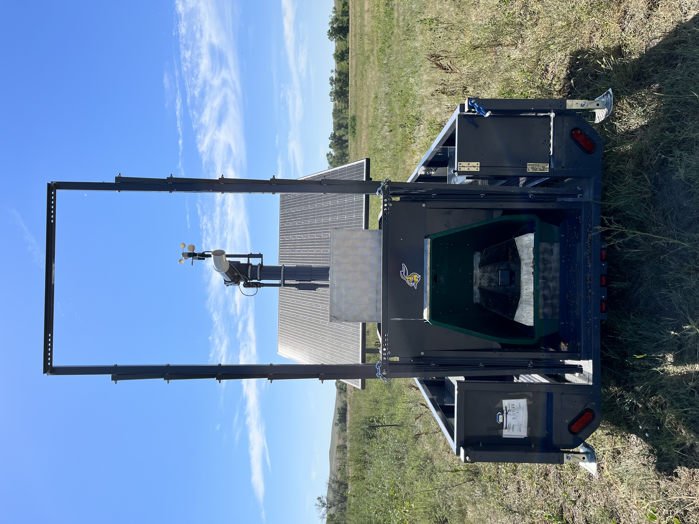

# C-Lock Application Program Interfaces {-}

Authored by Drs. *Jameson Brennan^1^, Ira Parsons^1^, Hector Menendez^1^, Meredith Harrison^2^*   
*^1^South Dakota State University, Dept. of Animal Science, Rapid City SD*  
*^2^C-Lock Inc. Rapid City SD*

## Abstract
Advances in sensor technology have ushered in the ability to collect vast amounts of data in real-time for animal production systems. Though
there is much promise in improving animal production and research utilizing precision systems, for this technology to be truly impactful, data
generated needs to be accessed and processed in near real time for relevant decision-making. In this paper, three application programming
interfaces were developed to facilitate near real-time data access. In addition, open-source tutorials were developed to generate summary
statistics of three precision livestock technologies and systems checks to ensure equipment is working properly and animal adoption rates of
technology are adequate for data collection. The development of data processing outlined in this paper will be essential for the successful implementation of precision technology and integration of data in real time with animal nutrition or decision-making algorithms [@brennan].